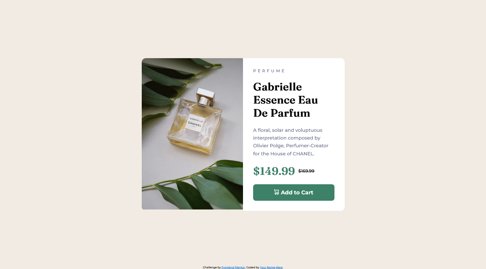

# Frontend Mentor - Product preview card component solution

This is a solution to the [Product preview card component challenge on Frontend Mentor](https://www.frontendmentor.io/challenges/product-preview-card-component-GO7UmttRfa). Frontend Mentor challenges help you improve your coding skills by building realistic projects. 

## Table of contents

- [Overview](#overview)
  - [Screenshot][def]
  - [Links](#links)
- [My process](#my-process)
  - [Built with](#built-with)
- [Author](#author)

## Overview

### Screenshot

### Links

- Solution URL: [Github](https://github.com/bijomathewjose/qr-code-component-main)
- Live Site URL: [Code Published](https://bijomathewjose.github.io/qr-code-component-main/)

## My process

### Built with

- Semantic HTML5 markup
- CSS custom properties
- Flexbox
- Grid

## Author

- Frontend Mentor - [@bijomathewjose](https://www.frontendmentor.io/profile/bijomathewjose)
- Twitter - [@bijomathewjose](https://www.twitter.com/bijomathewjose)

[def]: #screenshot
